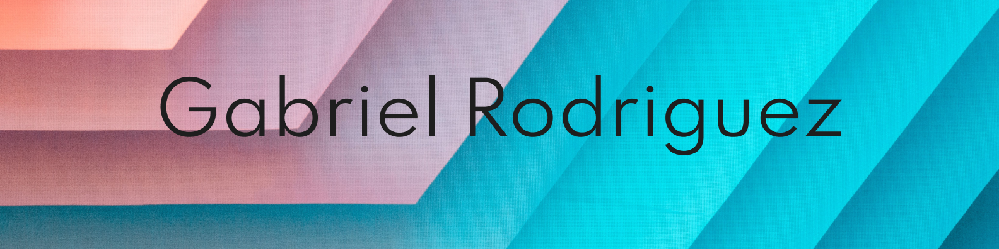
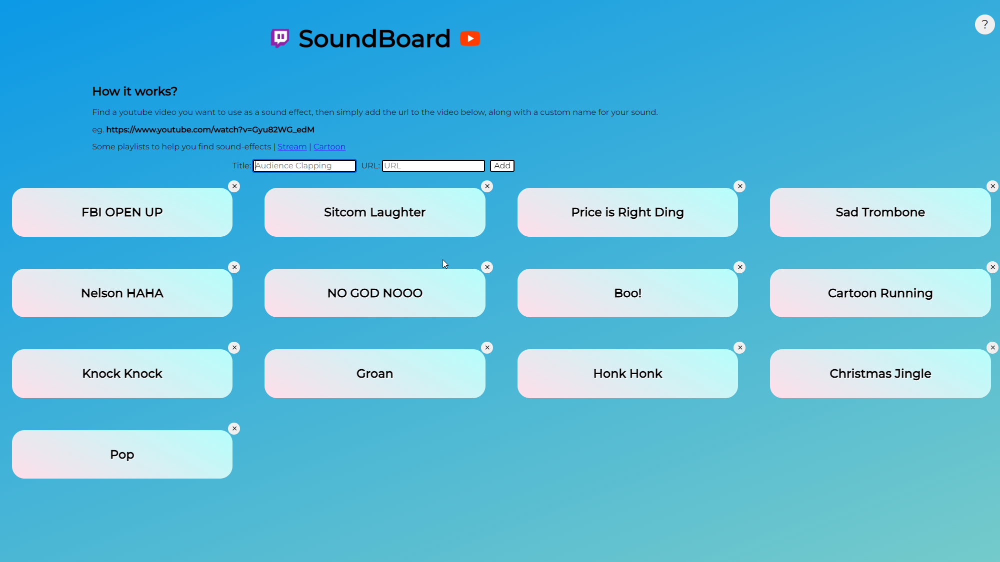

<!-- Format thanks to Shawn Charles, check his github here https://github.com/CharlesCreativeContent -->

  
  
   
  
 <!--
  
  -->

I'm a software enginner who is passionate about making the web more accessible to everyone and creating technology to elevate my community

See [my website](https://gabriel-dev.netlify.app/) for more information!

<h1 align="center">Projects</h1>
<table bordercolor="#66b2b2">
  
  <tr>
    <td width="50%" valign="top">
      <h3 align="center">Twisted Scissors Salon</h3>
         
        
         
        

          
    
  
      

        
<strong>HTML5, CSS3, & Javascript</strong> - Twisted Scissors site debuting stylists, gallery of looks and services.

    </td>
    <td width="50%" valign="top">
      <h3 align="center">Pellicano Pasta</h3>
         
      
         
        

          
  
  
      

        
<strong>HTML5, CSS3, & Javascript</strong> - Italian restuarant's menu showcased in an elegant design.

    </td>
  </tr>
  
  <tr>
    <td width="50%" valign="top">
      <h3 align="center">Gabriel-Dev Profile</h3>
       
        
       
        

  
  
      

        
<strong>HTML5, CSS3, & Javascript</strong> - Portfolio Site including links to my projects and ways to get in contact with me.

    </td>
    <td width="50%" valign="top">
      <h3 align="center">Soundboard for Content Creators</h3>
         
        
         
        

          
  
  
      

        
<strong>HTML5, CSS3, & Javascript</strong> - Soundboard orientated for content creators. Customizable title, colors. Remembers sound effects across sessions.

    </td>
  </tr>
</table>

<h1 align="center">Technologies</h1>

    
    
    
    
    
    
    
    
    

---

<h1 align="center">Connect</h1>

  
  
  
  <!--
  
  -->
  <!--
  
  -->

